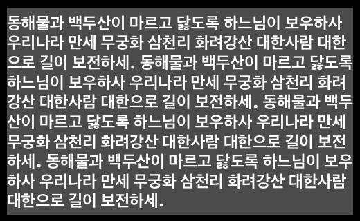
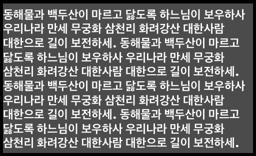

# SSSWordWrapLabel
Fixed an issue where wordwrap did not work in UILabel

For example, if a Hangul string is entered in UILabel, even if you set byWordWrapping, you can see like this:

But when you use  this label, you can check it like this:

# CONTACT
Please contact me if there are any improvements or issues in the code.\
lhseok0228@gmail.com
